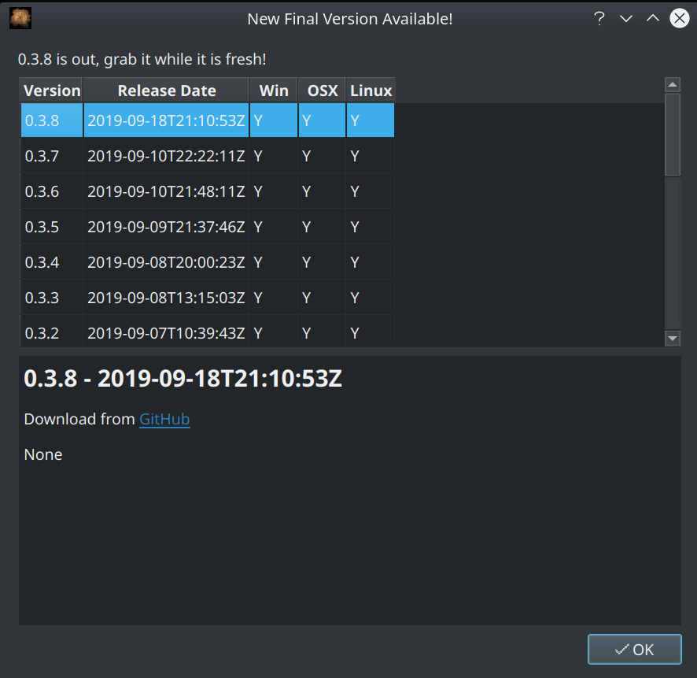
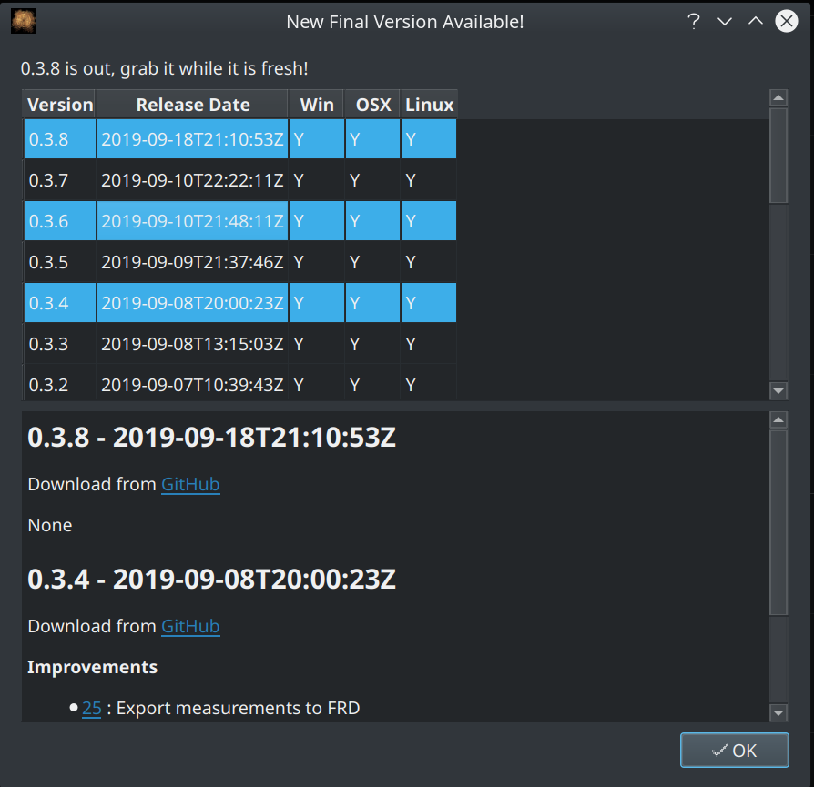

## Installation

Releases are hosted on github, the latest official release will always be available via the [github releases page](https://github.com/3ll3d00d/qvibe-analyser/releases/latest)

4 sets of binaries are provided for official releases:

File Name | OS | Description 
----------|----|------------
qvibe-analyser.exe | Windows | A portable, self contained exe which is built using the anaconda python distribution and hence uses the MKL libraries
qvibe-analyserSetup.exe | Windows | An installer, will startup more quickly than the portable exe which is built using the anaconda python distribution and hence uses the MKL libraries
qvibe-analyser_small.exe | Windows | A portable, self contained exe which is built using the python.org python distribution
qvibe-analyserSetup_small.exe | Windows | An installer, will startup more quickly than the portable exe which is built using the python.org python distribution 
qvibe-analyser_*distro*\_*version*\_*name* | Linux | A portable, self contained binary built for the specified distribution
qvibe-analyser.app.zip | OSX | An OSX app bundle 

To use, simply download one of the above binaries and run it.

### Checking for Updates

Release notes and download links are accessible via the *Help > Release Notes* menu item. This is also displayed on startup if a new version is detected and the github release api is accessible.

The OS columns show whether a binary is available for that operating system.

Multiple rows can be selected to see what has changed in each release.

If a binary is available for your operating system for any selected release, the download link will be provided alongside the release notes.

### Is there any difference between qvibe-analyser.exe and qvibe-analyserSetup.exe?

Functionally, no.

The only difference is that using qvibe-analyserSetup.exe should lead to faster startup times.

### Windows Smartscreen   

!!! warning
    Windows binaries are not signed so will be flagged as "Unknown" by Windows Defender. You will have to accept and disregard this warning in order to use BEQDesigner.

### OSX Builds

!!! note
    OSX binaries are not signed so the user has to explicitly allow it to run. Contributions are welcome to fix this issue, please track [the github issue](https://github.com/3ll3d00d/qvibe-analyser/issues/251) for more details.

### How can I trust these binaries?

All binaries are compiled on fresh VMs using [travis-ci](https://travis-ci.com/3ll3d00d/qvibe-analyser/branches) and publishes automatically to github by a [github machine user](https://developer.github.com/v3/guides/managing-deploy-keys/#machine-users).

Builds are created and published from tags in the repo.

This approach means the binaries are completely reproducible by anyone so feel free to make your own or run from source if you do not wish to trust the published binaries.
    
## Beta Releases

Beta releases are published more regularly than official releases. Beta releases provide early access to new or experimental features. Review the release notes for any particular beta release for more details.

They can be found via the full release page on [github](https://github.com/3ll3d00d/qvibe-analyser/releases).
